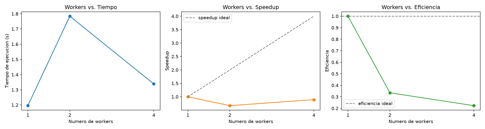
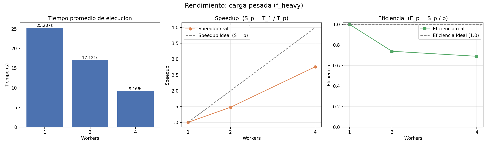

# HPC Parcial 1 — Comparación de ejecución secuencial vs. paralela

## Objetivo

Comparar la ejecución secuencial y paralela de una función matemática sobre un arreglo grande de datos, midiendo tiempo de ejecución, speedup y eficiencia con 1, 2 y 4 workers.

## Estructura del repositorio

```
hpc-parcial1/
├── src/
│ ├── compute.py # funcion f(x) y logica secuencial/paralela
│ ├── benchmark.py # mide tiempos, calcula speedup y eficiencia
│ └── plot_results.py # genera grafica de resultados
├── results/
│ ├── results.csv # resultados del benchmark
│ └── performance_plot.png # grafica generada
├── analisis.ipynb # notebook con desarrollo, experimentacion y graficas
├── requirements.txt
└── README.md
```

## Requisitos

```bash
pip install -r requirements.txt
```

## Cómo ejecutar

> **Nota:** en la máquina usada para el desarrollo solo existe el comando `python3` (no `python`), por eso los ejemplos usan `python3`. Dentro de un entorno virtual activado, `python` también funciona.

```bash
python3 src/benchmark.py --size 20000000 --workers 1 2 4 --repeats 3
python3 src/benchmark.py --heavy --size 2000000 --workers 1 2 4 --repeats 3
python3 src/plot_results.py
```

O abrir `analisis.ipynb`, que corre ambos pasos y muestra resultados y gráfica inline.

## Metodología

- **Función de prueba:** f(x) = sqrt(x) + x² + sin(x) + cos(x) + log(x)
- **Secuencial:** un solo proceso procesa todo el arreglo.
- **Paralela:** `ProcessPoolExecutor` divide el arreglo en `n_workers` partes y las procesa en paralelo.
- Cada configuración (1, 2, 4 workers) se corre 3 veces; se reporta el promedio.
- **Speedup:** S_p = T_1 / T_p
- **Eficiencia:** E_p = S_p / p

## Resultados

Tiempo promedio de 3 repeticiones por configuración (en segundos), speedup $S_p = T_1 / T_p$ y eficiencia $E_p = S_p / p$, para cada número de workers.

| Workers | Promedio (s) | Speedup | Eficiencia |
|--------:|-------------:|--------:|-----------:|
| 1 | 1.1955 | 1.0000 | 1.0000 |
| 2 | 1.7843 | 0.6700 | 0.3350 |
| 4 | 1.3386 | 0.8931 | 0.2233 |



### Carga pesada (f_heavy)

| Workers | Promedio (s) | Speedup | Eficiencia |
|--------:|-------------:|--------:|-----------:|
| 1 | 25.2872 | 1.0000 | 1.0000 |
| 2 | 17.1213 | 1.4769 | 0.7385 |
| 4 | 9.1663 | 2.7587 | 0.6897 |



## Análisis

1. **¿La ejecución paralela fue más rápida que la secuencial?**
   Depende de la carga. Con la función ligera f(x) **no**: la versión secuencial (1 worker) tardó 1.20 s,
   mientras que con 2 workers tardó 1.78 s y con 4 workers 1.34 s (speedup menor a 1).
   Con la carga pesada f_heavy **sí**: el tiempo bajó de 25.29 s (1 worker) a 17.12 s (2 workers) y a 9.17 s (4 workers).

2. **¿Qué número de workers obtuvo el menor tiempo?**
   Con carga ligera, **1 worker** (1.20 s): la versión secuencial fue la más rápida.
   Con carga pesada, **4 workers** (9.17 s), con un speedup de 2.76.

3. **¿Duplicar el número de workers duplicó el rendimiento? ¿Por qué?**
   **No.** Con carga ligera, pasar de 1 a 2 workers empeoró el tiempo (S₂ = 0.67). Con carga pesada, 2 workers
   dieron S₂ = 1.48 (no 2) y 4 workers S₄ = 2.76 (no 4); la eficiencia bajó de 1.0 a 0.74 y 0.69.
   La causa es el *overhead* de paralelizar: crear los procesos, copiar cada parte del arreglo a los workers y
   regresar los resultados, más las partes que siguen siendo secuenciales (generar los datos y unir los resultados), como predice la ley de Amdahl.

4. **¿Por qué el problema seleccionado puede paralelizarse?**
   Porque cada elemento se calcula de forma **independiente**: f(x_i) no depende de ningún otro valor del arreglo.
   Así, el arreglo se divide en `n_workers` bloques (`np.array_split`), cada proceso calcula su bloque sin
   comunicarse con los demás y al final se unen los resultados. Es un problema de paralelismo de datos (*embarrassingly parallel*).

5. **¿En qué momento agregar más workers deja de ser beneficioso?**
   Cuando el costo de repartir y comunicar los datos supera al cálculo que hace cada worker. Con la carga ligera
   eso ocurre desde 2 workers, así que paralelizar nunca convino. Con la carga pesada sí convino hasta 4 workers,
   aunque la eficiencia ya bajaba (0.74 → 0.69); más allá de 4, que son los núcleos físicos del equipo, se esperaría
   poca o ninguna mejora, porque los hilos extra del hyperthreading comparten las mismas unidades de cálculo.

6. **¿Qué limitaciones tiene el hardware utilizado?**
   El Intel i5-1135G7 es un procesador de laptop con **4 núcleos físicos / 8 lógicos** (hyperthreading), así que el
   paralelismo real se limita a unos 4 procesos de cálculo. Los núcleos comparten la caché L3 y el ancho de banda de
   la memoria RAM, y al ser un equipo portátil de bajo consumo puede bajar su frecuencia por temperatura en ejecuciones
   largas. Además, el sistema operativo y otros programas compiten por los mismos núcleos.

7. **¿Este experimento representa HPC o solamente demuestra principios utilizados en HPC? Justifiquen.**
   **Solo demuestra principios utilizados en HPC.** Se aplican conceptos reales —división de datos, ejecución en
   paralelo, mediciones repetidas, speedup, eficiencia y el efecto del overhead—, pero se ejecutó en una sola laptop
   de 4 núcleos. Un sistema HPC usa clústeres con muchos nodos y miles de núcleos, redes de interconexión de alta
   velocidad, herramientas como MPI y gestores de trabajos, para problemas de una escala mucho mayor.


## Flujo de trabajo (GitFlow)

- `main`: versión final estable que se entrega.
- `develop`: rama de integración de todas las features antes de pasar a main.
- `feature/*`: una rama por persona/tarea, con Pull Request hacia develop.

## Equipo

- Jonathan Gonzalez — implementación secuencial y paralela, benchmark
- [Nombre compañero 1] — gráfica de rendimiento
- Ricardo Leonel Ordaz Aguilar — pruebas unitarias y robustez
- Javier Yael Narváez Olguín — análisis de resultados
