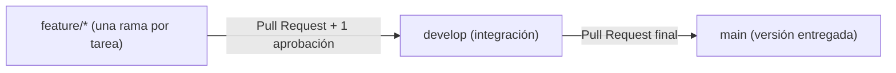

# Flujo de trabajo del proyecto (GitFlow)

Cada tarea se desarrolla en una rama `feature/*` y se integra en `develop` mediante un Pull Request.
La integración completa pasa de `develop` a `main` mediante un Pull Request final.
No se permiten cambios directos de `develop` a `main`.
Cada Pull Request requiere al menos 1 aprobación de otra persona del equipo.

## Cómo leer el diagrama

- Cada rama `feature/*` corresponde a una tarea.
- El primer Pull Request integra la tarea a `develop` y requiere aprobación de un compañero.
- El Pull Request final lleva la versión integrada de `develop` a `main`.
